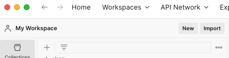
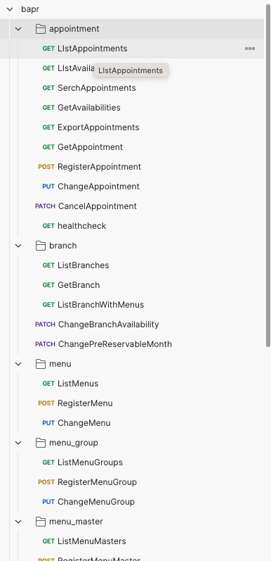

### postmanの使い方

## 1. postmanのインストール(自分の環境に合ったものをダンロードしてください)
- [postmanのダウンロード](https://www.postman.com/downloads/)

## 2. importをクリックし、todoappp.postman_collection.jsonファイルをドラッグ&ドロップする
- 

## 3. 以下のようになるので、APIを実行できます
- 